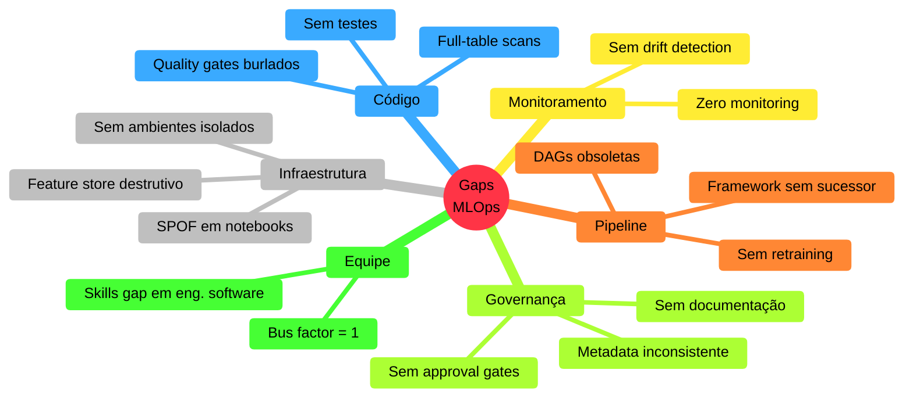
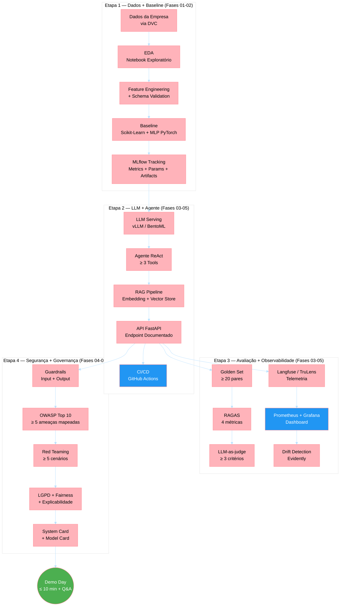
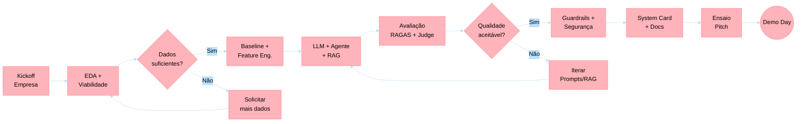
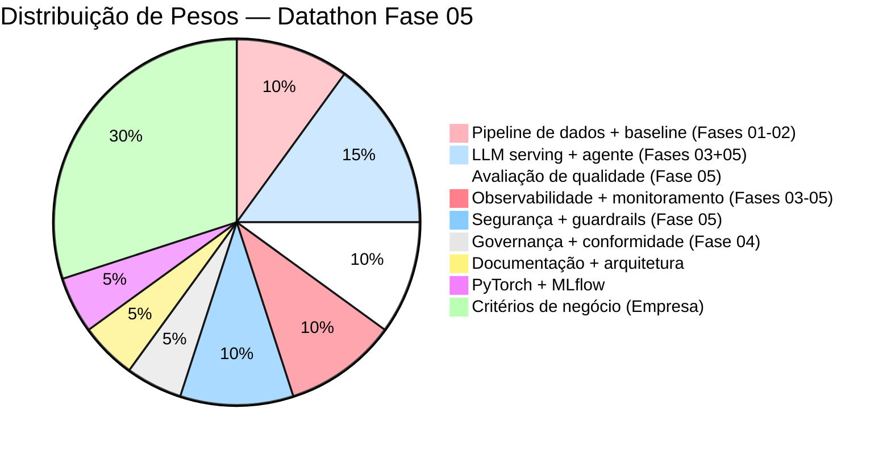

# Datathon — Guia de Desenvolvimento do Desafio da Fase 05

> **Fase**: 05 — LLMs e Agentes
> **Formato**: Datathon com Empresa Convidada
> **Tipo**: Projeto Integrador (Fases 01–05)
> **Referência canônica**: [`fases/fase-05-llms-e-agentes/governanca-da-fase/tech-challenge.md`](../../fases/fase-05-llms-e-agentes/governanca-da-fase/tech-challenge.md)

---

## Por que este guia existe

O Tech Challenge da Fase 05 é o **Datathon**: uma competição técnica baseada em um problema real fornecido por uma empresa convidada. Diferente dos desafios anteriores, aqui o enunciado vem da indústria e a avaliação é composta por banca mista (empresa + academia).

Este guia de desenvolvimento traduz os **gaps mais frequentes observados em plataformas de ML do mercado financeiro** em orientações práticas para os grupos que enfrentam o Datathon. O objetivo é antecipar armadilhas arquiteturais, de engenharia e de governança que equipes reais cometem — e que a banca avaliará.

O conteúdo é baseado em assessments de maturidade MLOps conduzidos em instituições financeiras reguladas e estruturado com os mesmos padrões do repositório `mlet`.

---

## Maturidade MLOps — O Que a Banca Espera

A banca avalia se o grupo atingiu **pelo menos Nível 2** do Microsoft MLOps Maturity Model nas dimensões críticas:

| Dimensão | Nível 0 (inaceitável) | Nível 1 (mínimo) | Nível 2 (esperado) |
|---|---|---|---|
| Experiment Management | Sem tracking | MLflow manual, metadata inconsistente | MLflow padronizado, metrics + params + artifacts |
| Model Management | Sem registro | Registro manual sem lineage | Model Registry com versionamento e metadata obrigatória |
| CI/CD | Sem pipeline | Pipeline manual, sem gates | GitHub Actions: lint → test → build → deploy (staging) |
| Monitoring | Sem observabilidade | Logs básicos | Métricas, drift detection, dashboard, alertas |
| Data Management | Dados soltos | Dados copiados manualmente | DVC/Delta Lake, versionamento, dados sintéticos em dev |
| Feature Management | Sem feature store | Feature store single-model | Features compartilhadas, materialização incremental |

> **Dica**: a avaliação técnica (70%) foca na demonstração de maturidade acumulada. Mesmo que o modelo final tenha métricas modestas, uma arquitetura bem governada pontuará mais que um modelo bom rodando de forma ad-hoc.

---

## Gaps Comuns em Plataformas de ML — O Que Evitar

### Taxonomia de Gaps Observados

Os gaps abaixo são derivados de avaliações reais em plataformas de ML de instituições financeiras. Cada gap inclui o anti-padrão, o impacto e a recomendação para o Datathon.



---

### GAP 01: Ausência de Monitoramento de Modelos

**Anti-padrão**: Modelo é deployado e nunca mais verificado. Ninguém sabe se está performando bem ou mal.

**Por que importa para o Datathon**: A Etapa 3 exige dashboard de observabilidade com métricas técnicas e de negócio. Entregar modelo sem monitoramento é o equivalente a entregar carro sem painel.

**Recomendação**:
- Prometheus + Grafana para métricas operacionais (latência, throughput, erros)
- Langfuse ou TruLens para métricas de qualidade LLM (faithfulness, relevancy)
- Evidently para drift detection em features/predições
- Alertas automáticos por degradação

**Competências mobilizadas**: Fase 03 (Prometheus/Grafana), Fase 04 (drift, observabilidade), Fase 05 (LLMOps telemetria)

---

### GAP 02: Notebook Compartilhado como SPOF

**Anti-padrão**: Um único notebook é o trigger de produção para múltiplos modelos. Uma edição quebra tudo.

**Evidência real**: Em instituição financeira, um cientista editou o notebook compartilhado. O modelo dele rodou. Todos os outros pararam. O MLE recebeu 30+ alertas no final de semana.

**Por que importa para o Datathon**: A banca penaliza blast radius alto. Se o pipeline do grupo tem um ponto único de falha, a nota de arquitetura será afetada.

**Recomendação**:
- Cada componente do pipeline deve ser isolado (jobs/tasks separados)
- Usar DAGs ou workflows declarativos (Airflow, Prefect, Databricks Asset Bundles)
- Compute isolado por job — nunca compartilhar cluster entre pipelines desconexos
- Tudo versionado em Git com deploy via CI/CD

**Competências mobilizadas**: Fase 02 (Docker, pipeline reprodutível), Fase 03 (CI/CD)

---

### GAP 03: Feature Store com Padrão Destrutivo (Full-Flush)

**Anti-padrão**: Feature store (Redis, cache) com estratégia "deleta tudo, carrega tudo, sempre". Durante a janela de flush, o store está vazio.

**Evidência real**: Em sistema de detecção de fraude, a cada 10-55 minutos todo o cache era deletado e recarregado. Na janela vazia, transações eram processadas sem features — decisões erradas sistematicamente.

**Por que importa para o Datathon**: Se o grupo usa feature store ou cache de contexto para RAG, a estratégia de atualização deve ser incremental, não destrutiva.

**Recomendação**:
- Upsert incremental (HSET/MSET com TTL) em vez de FLUSHALL + bulk load
- Change Data Feed (Delta) ou timestamps para processar apenas deltas
- Nunca ter janela de store vazio — isso é inaceitável em produção

**Competências mobilizadas**: Fase 02 (feature engineering), Fase 03 (deploy e serving)

---

### GAP 04: Cobertura de Testes Próxima a Zero

**Anti-padrão**: Quality gate configurado em thresholds triviais (1% coverage). Equipe burla SonarQube excluindo pastas. Ninguém sabe o que é pytest.

**Evidência real**: Em equipe de ML, a cobertura de testes estava em 1%. Quando perguntados, a resposta foi: "eles nem sabem o que é pytest". Um engenheiro editou o arquivo de configuração do SonarQube para excluir seu diretório.

**Por que importa para o Datathon**: A rubrica exige pytest funcional (Fases 01-02), CI/CD com testes (Fase 03) e validação de dados (Fase 04). Código sem testes = nota baixa em Pipeline + Arquitetura + Documentação.

**Recomendação**:
- `pytest` com `--cov-fail-under=60` no mínimo
- Testes de schema com `pandera` ou `great_expectations`
- Testes de feature engineering: input/output shapes, nulls, ranges
- Testes de inferência: determinismo, range de predições, count match
- Testes de integração para endpoints (FastAPI TestClient)

**Competências mobilizadas**: Fase 01 (fundamentos), Fase 02 (clean code, Docker), Fase 03 (CI/CD)

---

### GAP 05: Sem Governança de Versionamento de Modelos

**Anti-padrão**: Cada cientista loga informações diferentes no MLflow — ou nada. Sem tags padronizadas, sem lineage, sem approval workflow.

**Evidência real**: Em plataforma com 20+ modelos, era impossível responder: "Qual versão está em produção? Com quais dados foi treinada? Quem aprovou?"

**Por que importa para o Datathon**: A Etapa 4 exige Model Card / System Card. Sem metadata padronizada, o Model Card será genérico e a governança fraca.

**Recomendação**:
```python
# Schema mínimo obrigatório para registro de modelo
required_tags = {
    "model_name": str,         # Nome do modelo
    "model_version": str,      # Versão semântica
    "model_type": str,         # classification, regression, generation
    "training_data_version": str,  # Hash ou versão DVC
    "metrics": dict,           # {"auc": 0.95, "f1": 0.88}
    "owner": str,              # Email do responsável
    "risk_level": str,         # low, medium, high, critical
    "fairness_checked": bool,  # Auditoria de viés feita?
    "git_sha": str,            # Commit do código
}
```

**Competências mobilizadas**: Fase 04 (governança, LGPD), Fase 05 (System Card)

---

### GAP 06: Sem Detecção de Drift

**Anti-padrão**: Modelo deployado e esquecido. Nenhuma verificação de data drift ou concept drift. Degradação acontece silenciosamente.

**Por que importa para o Datathon**: A Etapa 3 exige "Detecção de drift implementada e documentada". É critério de aceite explícito.

**Recomendação**:
- Evidently para report de drift (data + prediction)
- PSI (Population Stability Index) como métrica principal
- Threshold: PSI > 0.1 = warning, PSI > 0.2 = retrain trigger
- Integrar com MLflow: logar métricas de drift junto com métricas de modelo

```python
from evidently.report import Report
from evidently.metric_preset import DataDriftPreset

report = Report(metrics=[DataDriftPreset()])
report.run(reference_data=train_df, current_data=prod_df)

drift_result = report.as_dict()
drift_share = drift_result["metrics"][0]["result"]["share_of_drifted_columns"]
```

**Competências mobilizadas**: Fase 04 (drift, observabilidade), Fase 05 (LLMOps)

---

### GAP 07: Ausência de Retraining Automatizado

**Anti-padrão**: Modelos retreinados manualmente, de forma ad-hoc, sem trigger programado. Em alguns casos, cada predição retreina o modelo (acoplamento treino-inferência).

**Por que importa para o Datathon**: Demonstrar champion-challenger evaluation mostra maturidade MLOps significativamente acima da média.

**Recomendação**:
- Retraining agendado (cron) como baseline
- Retraining event-driven (drift detectado → trigger pipeline)
- Validação champion-challenger antes de promover:
  - Carregar champion do Model Registry
  - Treinar challenger com dados novos
  - Comparar métricas em holdout set
  - Só promover se `delta_auc >= 0.005` (0.5% melhoria)
- Human-in-the-loop: approval gate antes de produção

**Competências mobilizadas**: Fase 03 (CI/CD), Fase 04 (monitoramento), Fase 05 (feedback loops)

---

### GAP 08: Ambiente de Desenvolvimento sem Dados

**Anti-padrão**: O ambiente de dev existe mas não contém dados. Todo teste acontece em produção.

**Evidência real**: Equipe de ML tinha Databricks dev configurado mas não havia dados lá. Resultado: cada mudança de código era testada diretamente em produção.

**Por que importa para o Datathon**: A rubrica exige pipeline reprodutível (DVC + Docker). Se o grupo não tem dados versionados e acessíveis para reprodução, perde pontos em Data Management.

**Recomendação**:
- `DVC` para versionar dados (não commitar dados no Git)
- Dados sintéticos para testes locais (SDV, Faker, fixtures)
- Dados anonimizados para staging (Presidio para PII, se aplicável)
- Script `make data` que reproduz ambiente local com dados de teste

**Competências mobilizadas**: Fase 02 (DVC, versionamento), Fase 04 (LGPD, anonimização)

---

### GAP 09: Skills Gap em Engenharia de Software

**Anti-padrão**: Cientistas de dados sem fundamentos de programação: desconhecem testes, type hints, error handling, Git flow. Resistem ativamente a controles de qualidade.

**Por que importa para o Datathon**: A rubrica de "Documentação e arquitetura" (5%) e "Pipeline de dados e baseline" (10%) avaliam qualidade de código. `pyproject.toml`, type hints, docstrings, logging estruturado são habilidades esperadas.

**Recomendação**:
```python
# Padrão mínimo de qualidade para o Datathon:

# 1. Type hints em todas as funções
def compute_features(df: pd.DataFrame, target_col: str) -> pd.DataFrame:
    ...

# 2. Docstrings com Args e Returns
def train_model(X: pd.DataFrame, y: pd.Series) -> tuple[Any, dict[str, float]]:
    """Treina modelo e retorna artefato + métricas.

    Args:
        X: Features de treinamento.
        y: Target.

    Returns:
        Tupla (modelo treinado, dicionário de métricas).
    """
    ...

# 3. Logging estruturado (nunca print)
import logging
logger = logging.getLogger(__name__)
logger.info("Treinamento concluído: AUC=%.4f", metrics["auc"])

# 4. pyproject.toml com dependências gerenciadas
# 5. .env para secrets (nunca hardcoded)
```

**Competências mobilizadas**: Fase 01 (fundamentos), Fase 02 (clean code, SOLID)

---

## Arquitetura de Referência para o Datathon

O diagrama abaixo mostra a arquitetura esperada para uma entrega completa no Datathon, integrando as 5 fases:



---

## Processo de Desenvolvimento Recomendado



---

## Estrutura de Repositório Recomendada

```
datathon-grupo-XX/
├── .github/
│   └── workflows/
│       └── ci.yml                     # GitHub Actions: lint + test + build
├── data/
│   ├── raw/                           # Dados brutos (NÃO commitar, usar DVC)
│   ├── processed/                     # Dados processados
│   └── golden_set/                    # ≥ 20 pares (query, expected, contexts)
├── src/
│   ├── features/
│   │   ├── __init__.py
│   │   └── feature_engineering.py     # Transformações de features
│   ├── models/
│   │   ├── __init__.py
│   │   ├── baseline.py                # Scikit-Learn + MLP PyTorch
│   │   └── train.py                   # Pipeline de treino com MLflow
│   ├── agent/
│   │   ├── __init__.py
│   │   ├── react_agent.py             # Agente ReAct
│   │   ├── tools.py                   # ≥ 3 tools customizadas
│   │   └── rag_pipeline.py            # RAG: embedding + retriever + generator
│   ├── serving/
│   │   ├── __init__.py
│   │   ├── app.py                     # FastAPI endpoint
│   │   └── Dockerfile                 # Container de serving
│   ├── monitoring/
│   │   ├── __init__.py
│   │   ├── drift.py                   # Evidently drift detection
│   │   └── metrics.py                 # Prometheus custom metrics
│   └── security/
│       ├── __init__.py
│       ├── guardrails.py              # Input/output guardrails
│       └── pii_detection.py           # Presidio PII detection
├── tests/
│   ├── conftest.py                    # Fixtures compartilhados
│   ├── test_features.py               # Testes de features
│   ├── test_models.py                 # Testes de modelo
│   ├── test_agent.py                  # Testes do agente
│   ├── test_api.py                    # Testes de endpoint
│   └── test_guardrails.py            # Testes de segurança
├── evaluation/
│   ├── ragas_eval.py                  # RAGAS: 4 métricas
│   ├── llm_judge.py                   # LLM-as-judge: ≥ 3 critérios
│   └── ab_test_prompts.py            # A/B test de prompts
├── docs/
│   ├── MODEL_CARD.md                  # Model Card
│   ├── SYSTEM_CARD.md                 # System Card
│   ├── LGPD_PLAN.md                   # Plano de conformidade LGPD
│   ├── OWASP_MAPPING.md              # ≥ 5 ameaças mapeadas
│   └── RED_TEAM_REPORT.md            # ≥ 5 cenários adversariais
├── notebooks/
│   └── 01_eda.ipynb                   # EDA exploratória
├── configs/
│   ├── model_config.yaml              # Hiperparâmetros
│   └── monitoring_config.yaml         # Thresholds de drift
├── docker-compose.yml                 # Orquestração local
├── dvc.yaml                           # Pipeline DVC
├── pyproject.toml                     # Dependências (Poetry/uv)
├── Makefile                           # Atalhos: make train, make serve, make test
├── .env.example                       # Template de variáveis de ambiente
├── .pre-commit-config.yaml            # Hooks de qualidade
└── README.md                          # Documentação principal
```

---

## Exemplos de Código Alinhados ao Datathon

### MLflow Tracking Padronizado (Etapa 1)

```python
# src/models/train.py
"""Pipeline de treinamento com MLflow tracking padronizado."""
import logging

import mlflow
import pandas as pd
from sklearn.metrics import (
    f1_score,
    precision_score,
    recall_score,
    roc_auc_score,
)
from sklearn.model_selection import train_test_split

logger = logging.getLogger(__name__)


def train_and_log(
    df: pd.DataFrame,
    target_col: str,
    model_name: str,
    model_class,
    model_params: dict,
    test_size: float = 0.2,
    random_state: int = 42,
) -> str:
    """Treina modelo, loga tudo no MLflow, retorna run_id.

    Args:
        df: DataFrame com features e target.
        target_col: Nome da coluna target.
        model_name: Nome para registro no MLflow.
        model_class: Classe do modelo (ex: RandomForestClassifier).
        model_params: Hiperparâmetros do modelo.
        test_size: Proporção de teste.
        random_state: Semente para reprodutibilidade.

    Returns:
        run_id do experimento MLflow.
    """
    X = df.drop(columns=[target_col])
    y = df[target_col]
    X_train, X_test, y_train, y_test = train_test_split(
        X, y, test_size=test_size, random_state=random_state, stratify=y
    )

    with mlflow.start_run(run_name=model_name) as run:
        # Log de parâmetros
        mlflow.log_params(model_params)
        mlflow.log_param("test_size", test_size)
        mlflow.log_param("random_state", random_state)
        mlflow.log_param("n_features", X_train.shape[1])
        mlflow.log_param("n_samples_train", X_train.shape[0])

        # Tags padronizadas (obrigatório)
        mlflow.set_tag("model_type", "classification")
        mlflow.set_tag("framework", model_class.__module__.split(".")[0])
        mlflow.set_tag("owner", "grupo-XX")
        mlflow.set_tag("phase", "datathon-fase05")

        # Treino
        model = model_class(**model_params)
        model.fit(X_train, y_train)
        y_pred = model.predict(X_test)

        # Métricas padronizadas
        metrics = {
            "auc": roc_auc_score(y_test, y_pred),
            "precision": precision_score(y_test, y_pred, zero_division=0),
            "recall": recall_score(y_test, y_pred, zero_division=0),
            "f1": f1_score(y_test, y_pred, zero_division=0),
        }
        mlflow.log_metrics(metrics)

        # Log do modelo
        mlflow.sklearn.log_model(model, "model")

        logger.info(
            "Modelo %s treinado: AUC=%.4f, F1=%.4f",
            model_name,
            metrics["auc"],
            metrics["f1"],
        )

        return run.info.run_id
```

### Testes Padronizados (Etapa 1)

```python
# tests/conftest.py
"""Fixtures compartilhados para testes."""
import pandas as pd
import pytest


@pytest.fixture
def sample_data() -> pd.DataFrame:
    """Dados sintéticos para testes (nunca dados reais)."""
    return pd.DataFrame({
        "feature_1": [0.1, 0.5, 0.9, 0.3, 0.7, 0.2, 0.8, 0.4],
        "feature_2": [1.0, 2.0, 3.0, 4.0, 5.0, 1.5, 3.5, 2.5],
        "feature_cat": ["A", "B", "A", "C", "B", "A", "C", "B"],
        "target": [0, 1, 1, 0, 1, 0, 1, 0],
    })


# tests/test_features.py
"""Testes de feature engineering — schema contracts."""
import pandera as pa
from pandera import Column, DataFrameSchema

from src.features.feature_engineering import compute_features


FEATURE_SCHEMA = DataFrameSchema({
    "feature_1": Column(float, pa.Check.between(0, 1)),
    "feature_2": Column(float, pa.Check.gt(0)),
    "feature_1_x_feature_2": Column(float),
})


def test_schema_contract(sample_data):
    """Features de saída devem respeitar o contrato de schema."""
    result = compute_features(sample_data)
    FEATURE_SCHEMA.validate(result)


def test_no_nulls(sample_data):
    """Nenhuma feature pode ter null após transformação."""
    result = compute_features(sample_data)
    assert result.isnull().sum().sum() == 0


def test_row_count_preserved(sample_data):
    """Número de registros deve ser preservado."""
    result = compute_features(sample_data)
    assert len(result) == len(sample_data)
```

### Agente ReAct com Tools (Etapa 2)

```python
# src/agent/react_agent.py
"""Agente ReAct com tools customizadas para o domínio do Datathon.

Referência: Yao et al. (2023) — ReAct: Synergizing Reasoning and Acting
            in Language Models. https://arxiv.org/abs/2210.03629
"""
import logging

from langchain.agents import AgentExecutor, create_react_agent
from langchain.prompts import PromptTemplate
from langchain_community.chat_models import ChatOpenAI
from langchain.tools import Tool

logger = logging.getLogger(__name__)

REACT_PROMPT = PromptTemplate.from_template("""Você é um assistente especializado.
Use as ferramentas disponíveis para responder perguntas.

Ferramentas disponíveis:
{tools}

Use o formato:
Thought: pensar sobre o que fazer
Action: nome_da_ferramenta
Action Input: input para a ferramenta
Observation: resultado da ferramenta
... (repita Thought/Action/Observation quantas vezes necessário)
Thought: Agora sei a resposta final
Final Answer: resposta para o usuário

Pergunta: {input}
{agent_scratchpad}""")


def create_datathon_agent(
    tools: list[Tool],
    model_name: str = "gpt-4o-mini",
    temperature: float = 0.0,
) -> AgentExecutor:
    """Cria agente ReAct para o Datathon.

    Args:
        tools: Lista de ferramentas (≥ 3 obrigatório).
        model_name: Modelo LLM a utilizar.
        temperature: Temperatura de geração.

    Returns:
        AgentExecutor configurado.
    """
    if len(tools) < 3:
        logger.warning("Datathon exige ≥ 3 tools. Fornecidas: %d", len(tools))

    llm = ChatOpenAI(model=model_name, temperature=temperature)
    agent = create_react_agent(llm=llm, tools=tools, prompt=REACT_PROMPT)

    return AgentExecutor(
        agent=agent,
        tools=tools,
        verbose=True,
        max_iterations=10,
        handle_parsing_errors=True,
    )
```

### RAGAS Evaluation (Etapa 3)

```python
# evaluation/ragas_eval.py
"""Avaliação do pipeline RAG com RAGAS — 4 métricas obrigatórias.

Referência: Es et al. (2024) — RAGAS: Automated Evaluation of Retrieval
            Augmented Generation. https://arxiv.org/abs/2309.15217
"""
import json
import logging

from datasets import Dataset
from ragas import evaluate
from ragas.metrics import (
    answer_relevancy,
    context_precision,
    context_recall,
    faithfulness,
)

logger = logging.getLogger(__name__)


def evaluate_rag_pipeline(
    golden_set_path: str,
    rag_fn,
) -> dict[str, float]:
    """Avalia pipeline RAG contra golden set.

    Args:
        golden_set_path: Caminho para JSON com golden set.
        rag_fn: Função que recebe query e retorna
                (answer, contexts).

    Returns:
        Dicionário com 4 métricas RAGAS.
    """
    with open(golden_set_path) as f:
        golden_set = json.load(f)

    # Gera respostas do pipeline
    results = []
    for item in golden_set:
        answer, contexts = rag_fn(item["query"])
        results.append({
            "question": item["query"],
            "answer": answer,
            "contexts": contexts,
            "ground_truth": item["expected_answer"],
        })

    dataset = Dataset.from_list(results)

    # Avaliação RAGAS — 4 métricas obrigatórias
    scores = evaluate(
        dataset,
        metrics=[
            faithfulness,
            answer_relevancy,
            context_precision,
            context_recall,
        ],
    )

    metrics = {
        "faithfulness": scores["faithfulness"],
        "answer_relevancy": scores["answer_relevancy"],
        "context_precision": scores["context_precision"],
        "context_recall": scores["context_recall"],
    }

    logger.info("RAGAS scores: %s", metrics)
    return metrics
```

### Guardrails de Input e Output (Etapa 4)

```python
# src/security/guardrails.py
"""Guardrails de segurança para input e output do agente.

Referência: OWASP Top 10 for LLM Applications (2025)
            https://owasp.org/www-project-top-10-for-large-language-model-applications/
"""
import logging
import re

from presidio_analyzer import AnalyzerEngine
from presidio_anonymizer import AnonymizerEngine

logger = logging.getLogger(__name__)


class InputGuardrail:
    """Valida e sanitiza input do usuário antes de enviar ao LLM."""

    # Padrões comuns de prompt injection
    INJECTION_PATTERNS = [
        r"ignore\s+(all\s+)?previous\s+instructions",
        r"you\s+are\s+now\s+a",
        r"system:\s*",
        r"<\|im_start\|>",
        r"\[INST\]",
        r"forget\s+(everything|all|your\s+instructions)",
    ]

    def __init__(self, allowed_topics: list[str] | None = None):
        self.allowed_topics = allowed_topics or []
        self._compiled_patterns = [
            re.compile(p, re.IGNORECASE) for p in self.INJECTION_PATTERNS
        ]

    def validate(self, user_input: str) -> tuple[bool, str]:
        """Valida input do usuário.

        Args:
            user_input: Texto do usuário.

        Returns:
            Tupla (is_valid, reason).
        """
        # Check 1: Prompt injection detection
        for pattern in self._compiled_patterns:
            if pattern.search(user_input):
                logger.warning("Prompt injection detectado: %s", user_input[:100])
                return False, "Input bloqueado: padrão suspeito detectado."

        # Check 2: Tamanho máximo (evitar context stuffing)
        if len(user_input) > 4096:
            return False, "Input bloqueado: excede tamanho máximo (4096 chars)."

        return True, "OK"


class OutputGuardrail:
    """Valida e sanitiza output do LLM antes de retornar ao usuário."""

    def __init__(self, language: str = "pt"):
        self.analyzer = AnalyzerEngine()
        self.anonymizer = AnonymizerEngine()
        self.language = language

    def sanitize(self, llm_output: str) -> str:
        """Remove PII do output do LLM.

        Args:
            llm_output: Texto gerado pelo LLM.

        Returns:
            Texto sanitizado.
        """
        results = self.analyzer.analyze(
            text=llm_output,
            language=self.language,
            entities=["PERSON", "EMAIL_ADDRESS", "PHONE_NUMBER", "BR_CPF"],
        )

        if results:
            logger.warning("PII detectado no output: %d entidades", len(results))
            anonymized = self.anonymizer.anonymize(
                text=llm_output,
                analyzer_results=results,
            )
            return anonymized.text

        return llm_output
```

### GitHub Actions CI (Etapa 2)

```yaml
# .github/workflows/ci.yml
name: Datathon CI

on:
  push:
    paths: ['src/**', 'tests/**', 'evaluation/**']
  pull_request:
    paths: ['src/**', 'tests/**', 'evaluation/**']

jobs:
  quality:
    runs-on: ubuntu-latest
    permissions:
      contents: read
    steps:
      - uses: actions/checkout@v4

      - name: Setup Python
        uses: actions/setup-python@v5
        with:
          python-version: '3.11'
          cache: 'pip'
          cache-dependency-path: 'pyproject.toml'

      - name: Install dependencies
        run: pip install -e ".[dev]"

      - name: Lint (ruff)
        run: ruff check src/ tests/ evaluation/

      - name: Type check (mypy)
        run: mypy src/ --ignore-missing-imports

      - name: Security scan (bandit)
        run: bandit -r src/ -c pyproject.toml

      - name: Unit tests (pytest)
        run: |
          pytest tests/ -x \
            --cov=src \
            --cov-report=xml \
            --cov-fail-under=60 \
            --junitxml=test-results.xml

      - name: Upload test results
        if: always()
        uses: actions/upload-artifact@v4
        with:
          name: test-results
          path: |
            test-results.xml
            coverage.xml
```

---

## Checklist de Entrega Final

Use este checklist como guia antes do Demo Day:

### Etapa 1 — Dados + Baseline
- [x] EDA documentada com insights relevantes para o problema da empresa
- [x] Baseline treinado e métricas reportadas no MLflow
- [x] Pipeline versionado (DVC + Docker) e reprodutível
- [x] Métricas de negócio mapeadas para métricas técnicas
- [x] `pyproject.toml` com todas as dependências

### Etapa 2 — LLM + Agente
- [ ] LLM servido via API com quantização aplicada
- [ ] Agente ReAct funcional com ≥ 3 tools relevantes ao domínio
- [ ] RAG retornando contexto relevante dos dados fornecidos
- [x] CI/CD pipeline funcional (GitHub Actions)
- [ ] Benchmark documentado com ≥ 3 configurações

### Etapa 3 — Avaliação + Observabilidade
- [ ] Golden set com ≥ 20 pares relevantes ao domínio
- [ ] RAGAS: 4 métricas calculadas e reportadas
- [ ] LLM-as-judge com ≥ 3 critérios (incluindo critério de negócio)
- [ ] Telemetria e dashboard funcionando end-to-end
- [ ] Detecção de drift implementada e documentada

### Etapa 4 — Segurança + Governança
- [ ] OWASP mapping com ≥ 5 ameaças e mitigações
- [ ] Guardrails de input e output funcionais
- [ ] ≥ 5 cenários adversariais testados e documentados
- [ ] Plano LGPD aplicado ao caso real
- [ ] Explicabilidade e fairness documentados
- [ ] System Card completo

### Demo Day
- [ ] Pitch ≤ 10 min: Problema → Abordagem → Demo → Resultados → Impacto
- [ ] Ensaio prévio com timer
- [ ] Backup: slides offline caso a demo falhe
- [ ] Preparação para Q&A técnico e de negócio

---

## Distribuição dos Pesos na Avaliação



---

## Referências

### Acadêmicas
1. Yao, S. et al. (2023). _"ReAct: Synergizing Reasoning and Acting in Language Models"_. ICLR 2023. https://arxiv.org/abs/2210.03629
2. Es, S. et al. (2024). _"RAGAS: Automated Evaluation of Retrieval Augmented Generation"_. https://arxiv.org/abs/2309.15217
3. Breck, E. et al. (2017). _"The ML Test Score: A Rubric for ML Production Readiness and Technical Debt Reduction"_. IEEE BigData.
4. Mitchell, M. et al. (2019). _"Model Cards for Model Reporting"_. FAT* Conference.
5. Sculley, D. et al. (2015). _"Hidden Technical Debt in Machine Learning Systems"_. NeurIPS.

### Frameworks e Guias
6. Microsoft (2024). _"MLOps Maturity Model"_. Azure ML Documentation.
7. Google (2023). _"Rules of Machine Learning: Best Practices for ML Engineering"_.
8. Google (2023). _"Practitioners Guide to MLOps"_.
9. OWASP (2025). _"OWASP Top 10 for Large Language Model Applications"_. https://owasp.org/www-project-top-10-for-large-language-model-applications/

### Regulatórias
10. Brasil (2018). _Lei nº 13.709/2018 (LGPD)_ — Proteção de dados pessoais.

### Repositórios de Referência
11. FIAP (2025). _MLET Pós-Tech_ — Repositório `mlet`. Fases 01–05.
12. FIAP (2025). _Materiais MLET_ — Repositório `Materiais-MLET`. Conteúdo técnico executável.